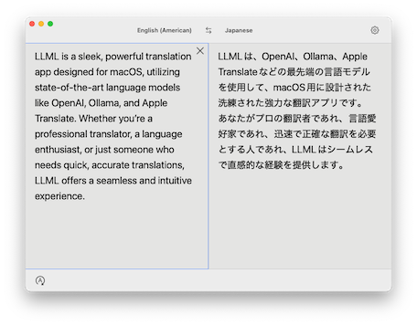

# LLML

🚀 **LLML** - LLM-powered Language Translator for macOS

LLML is a sleek, powerful translation app designed for macOS, utilizing state-of-the-art language models like OpenAI, Ollama, and Apple Translate. Whether you’re a professional translator, a language enthusiast, or just someone who needs quick, accurate translations, LLML offers a seamless and intuitive experience.

<p align="center">
    
</p>

## 🌟 Features

- 🛠️ **Real-Time Translation**
  - Translate text instantly between over 55 languages, with support for both simple phrases and complex sentences.

- 📦 **Flexible Language Support**
  - Choose from a wide range of source and target languages, including regional variations like American and British English.

- 🎛️ **Customizable Translation Providers**
  - Switch effortlessly between OpenAI, Ollama, and Apple Translate (requires macOS 15.0+), allowing you to use the service that best suits your needs.

- 🖋️ **Clipboard Monitoring**
  - Automatically detects text copied to your clipboard and translates it instantly (requires Accessibility permissions).

- 💡 **Intelligent Layouts**
  - Choose between horizontal and vertical layouts to optimize your workflow and maximize productivity.

- ⚡ **Token Management**
  - Track your input and output token usage in real time and reset counts as needed.

- 🌐 **Offline and Online Support**
  - Leverage Apple Translate’s local processing for offline translations or use OpenAI and Ollama for online, model-powered translations.

## 📋 Requirements

- macOS 14.0 (Sonoma) or later.
- Optional: OpenAI API Key (if using OpenAI as your translation provider).
- Optional: [Ollama](https://ollama.com) (requires proper URL and model configuration).

## 🚀 Installation

### For Users

1. Visit the [Latest Release](https://github.com/watanabetoshinori/LLML/releases) page.  
2. Open the **Assets** section, download the `.zip` file.  
3. Extract the downloaded `.zip` file.  
4. Move the extracted `LLML.app` to the `Applications` folder.  
5. Double-click `LLML.app` to launch the application.  

### For Developers

1. Clone the repository:

    ```sh
    git clone https://github.com/watanabetoshinori/LLML.git
    cd LLML
    ```

2. Open the project in Xcode:

    ```sh
    cd App
    open LLML.xcodeproj
    ```

3. Build and run the app.
4. Ensure you configure your translation provider settings after launching the app.

## 💡 Usage

1. **Translate Text**:
   - Enter text in the source field, and the translation will appear instantly in the target field.
   - Switch languages using the dropdown menus for source and target languages.

2. **Clipboard Translation**:
   - Copy any text to your clipboard, and LLML will automatically translate it.

3. **Customize Layout**:
   - Navigate to settings to choose between horizontal and vertical layouts.

4. **Switch Providers**:
   - Use the bottom toolbar to toggle between OpenAI, Ollama, and Apple Translate.

5. **Manage Tokens**:
   - Track token usage for OpenAI translations directly in the settings panel.

## ❓ FAQ

**Q: Is LLML free?**
A: LLML itself is free to use, but OpenAI usage may incur additional costs based on your API usage. See [OpenAI Pricing](https://openai.com/api/pricing/) site for more details.

**Q: Do I need an API Key for all providers?**
A: No, only OpenAI requires an API Key. Ollama and Apple Translate do not require additional keys but may have other setup requirements.

**Q: Can I use LLML offline?**
A: Yes, [Ollama](https://ollama.com) and Apple Translate support offline translations after downloading the necessary models.

## 📄 License

This project is licensed under the MIT License. See the [LICENSE](LICENSE) file for details.

## 👤 Author

Watanabe Toshinori

## 🙏 Acknowledgments

We would like to express our gratitude to the open-source community and the developers of the following libraries, which have made this project possible:

- [OpenAI (Swift SDK)](https://github.com/MacPaw/OpenAI.git)
- [OllamaKit](https://github.com/kevinhermawan/OllamaKit.git)
